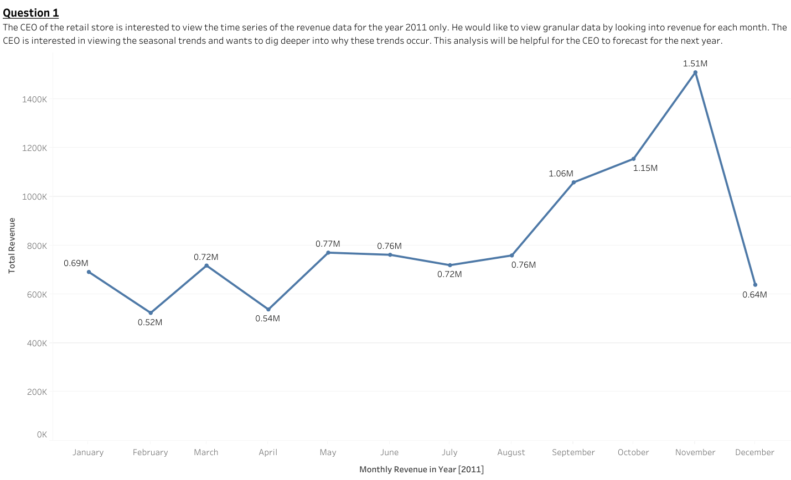

# Retail Sales Analysis with Tableau
Welcome to the repository for my completed TATA Data Visualisation Virtual Experience Program hosted on The Forage. This simulation mimics real-world tasks performed by data analysts and visualisation professionals at TATA, focusing on insights-driven business reporting.
## 📊 Project Overview
This project presents a data-driven analysis of retail sales using Tableau. The goal was to address key questions raised by the CEO and CMO regarding revenue trends, customer performance, and regional demand, using 2011 sales data.

## 📌 Task Breakdown

 ### ✅ Task 1: Data Cleaning
- Removed rows with negative quantities and zero/negative unit prices
- Filtered transactions for the year 2011
- Ensured consistent column formatting

### ✅ Task 2: Exploratory Data Analysis
- Framed the business questions from the CEO's & CMO’s perspective:
- What are the monthly revenue trends?
- Which international countries (excluding the UK) are performing best?
- Who are our top customers?
- Where should we expand next?

### ✅ Task 3: Data Visualisation
- Created key visualisations using Power BI:
- Line chart for monthly revenue trends
- Bar chart for the top 10 countries by revenue (excluding the UK)
- Bar chart for the top 10 customers by revenue
- Map chart to highlight expansion opportunities by demand

### ✅ Task 4: Presentation
- Delivered a clear 5-minute business presentation answering stakeholder questions using insights from visualised data, including:
- Seasonality awareness (e.g., revenue peak in November)
- Expansion markets (e.g., Netherlands, Ireland, Australia)
- Retention strategy for high-value customers

## 🔍 Business Questions Answered

1. **Monthly Revenue Trend (2011)**  
   To identify seasonal revenue patterns and support demand forecasting.

2. **Top 10 Countries by Revenue (Excluding UK)**  
   To highlight high-performing international markets for focused marketing.

3. **Top 10 Customers by Revenue**  
   To identify high-value customers and inform retention strategies.

4. **Product Demand by Country (Excluding UK)**  
   To determine high-demand regions and evaluate expansion opportunities.

## 🧼 Data Cleaning
- Removed records where `Quantity < 1` to eliminate returns.
- Excluded entries with `Unit Price < 0` to remove data errors.
- Cleaned data was used across all visualizations for reliable analysis.

## 🖥️ Tools Used
- **Tableau** – Data visualization and dashboard creation
- **Excel** – Basic data cleaning and formatting

## 📁 Files Included
- [Visualization/Questions.twb]() – Tableau Workbook containing all dashboards
- [Visualization/Retail_Analysis_Presentation.pptx]() – Slide deck used for executive presentation
- [Visualization/Presentation_Script.txt]() – 5-minute narration script
- [Online Retail Dataset.xlsx/]() – (optional) Cleaned data in CSV format

## 📊 Dashboard Preview

This animation showcases:
- 📈 Monthly Revenue Trends (Q1)
- 🌍 Top Countries by Revenue (Q2)
- 👤 Top Customers by Revenue (Q3)
- 🗺️ Product Demand by Country (Q4)

## 🤝 Contact
Created by **Chaitanya (Chaitu)** – Reach out via GitHub or LinkedIn for collaboration or questions.
